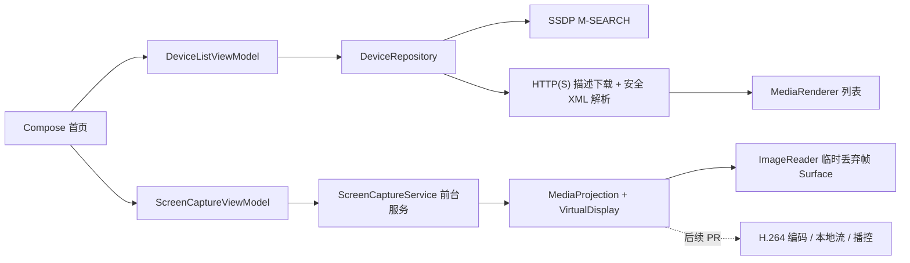

# DLNAScreenCastDemo

Android 手机投屏技术 Demo。项目按 7 个小 PR 逐步完成一个可演示、可测试、可下载 APK 的原型。

当前仓库开发到 **PR 3：MediaProjection 屏幕采集骨架**。本阶段在 PR 2 设备发现能力之上，增加系统录屏授权、前台服务、`VirtualDisplay`、临时丢弃帧 Surface、状态展示和幂等资源释放。

## 技术目标

| 指标 | 目标值 | 当前结果 |
|---|---:|---|
| 投屏延迟 | `< 2 秒` | 未实测 |
| 视频分辨率 | `1080P` | 未实测 |
| 视频码率 | `8 Mbps` | 未实测 |
| 音频码率 | `AAC 128 Kbps` | 未实测 |
| 平台 | Android Demo | PR 3 已实现屏幕采集骨架代码 |

目标值不代表已达成结果。PR 2 已在 Android 真机和 Kodi 环境完成局域网 Renderer 发现实测；PR 3 只验证屏幕采集骨架。编码、推流、播放控制和性能指标仍未实测。

## 技术架构



## PR 2 已实现

- SSDP `M-SEARCH`，范围固定为 `MediaRenderer:1` 和 `ssdp:all`。
- 按规范化后的 `LOCATION` 去重。
- 解析 `UDN`、`friendlyName`、`manufacturer`、`modelName` 和 AVTransport `controlURL`。
- 设备 ID 优先使用 `UDN`，缺失时回退到描述文档 URL。
- 缺少 AVTransport 的 Renderer 仍展示，并明确标记不可用于后续播控。
- HTTP(S) 描述下载限制超时、响应体大小和最多 1 次重定向。
- XML 禁用 DTD 和外部实体，避免 XXE。
- Android 不支持部分 JAXP 附加防护配置时记录 debug 日志并继续解析，避免阻断正常 Renderer。
- 首页展示搜索状态、设备列表和无电视排查提示。

## PR 3 已实现

- 每次开始采集都重新请求系统录屏授权，不保存或复用旧 token。
- Android 14+ 使用系统默认授权模式，让用户选择共享整个屏幕或只共享一个应用。
- 授权成功后先启动 `mediaProjection` 类型前台服务，再调用 `getMediaProjection()`。
- 注册 `MediaProjection.Callback`，统一处理系统停止、尺寸变化和可见性日志。
- 使用 `WindowManager.maximumWindowMetrics` 和 `Configuration.densityDpi` 获取当前采集尺寸。
- 使用 `ImageReader(maxImages = 2)` 临时消费并立即关闭最新图像，不保存、不上传、不打印画面内容。
- 首页展示采集状态和当前尺寸，支持 App 内停止和通知停止 action。
- 停止路径按固定顺序幂等释放资源，多次停止不会重复释放。

## 本阶段不实现

PR 3 不实现以下能力：

- H.264 编码
- AAC 音频
- 本地 HTTP 流
- `ffplay` 播放
- DLNA AVTransport 播放控制
- 延迟 `< 2 秒` 实测

`1080P`、`8 Mbps`、`AAC 128 Kbps`、延迟 `< 2 秒` 均为目标指标，当前未实测。PR 3 的采集尺寸来自设备当前屏幕，不固定为 `1080P`。

## 运行环境

- Android Studio：建议使用支持 AGP `9.2.1` 的版本
- Gradle Wrapper：`9.4.1`
- Android Gradle Plugin：`9.2.1`
- Kotlin：AGP 内建 Kotlin `2.2.10`
- `compileSdk`：Android `36.1`
- `minSdk`：Android `26`
- 应用包名：`com.qierong.dlnascreencastdemo`

## 权限说明

Manifest 声明：

```text
INTERNET
ACCESS_NETWORK_STATE
CHANGE_WIFI_MULTICAST_STATE
NEARBY_WIFI_DEVICES
FOREGROUND_SERVICE
FOREGROUND_SERVICE_MEDIA_PROJECTION
POST_NOTIFICATIONS
```

- Android 13+ 搜索前请求 `NEARBY_WIFI_DEVICES`，并使用 `neverForLocation`。
- `ACCESS_NETWORK_STATE` 用于判断当前是否连接 Wi-Fi，并提供明确错误提示。
- SSDP 和设备描述文档依赖局域网访问。许多 Renderer 使用 HTTP 描述地址，因此 App 允许明文 HTTP。
- Android 13+ 首次开始采集时可以请求 `POST_NOTIFICATIONS`。拒绝通知权限可能影响通知栏展示，但不会阻断系统录屏授权流程。
- Android 14+ 使用 `createScreenCaptureIntent()` 的系统默认用户选择模式，不传入 `createConfigForDefaultDisplay()`。系统应允许用户选择共享整个屏幕或只共享一个应用；实际弹窗样式和单应用选择流程可能受厂商 ROM 影响。
- 每次屏幕采集会话都必须重新授权。停止后不得复用旧授权数据或旧 `MediaProjection`。
- Android 16 的本地网络限制为选择启用阶段，不应描述为“Android 16 必须请求附近设备权限”。
- Android 17、`targetSdk 37+` 需要迁移到 `ACCESS_LOCAL_NETWORK`；该迁移点留给后续兼容性 PR。

参考：

- [附近 Wi-Fi 设备权限](https://developer.android.com/develop/connectivity/wifi/wifi-permissions)
- [本地网络权限](https://developer.android.com/privacy-and-security/local-network-permission?hl=zh-cn)

## 如何构建

Windows PowerShell：

```powershell
.\gradlew.bat assembleDebug
.\gradlew.bat testDebugUnitTest
```

Debug APK 输出路径：

```text
app/build/outputs/apk/debug/app-debug.apk
```

## 如何安装 APK

连接 Android 手机并启用 USB 调试后执行：

```powershell
adb install -r app/build/outputs/apk/debug/app-debug.apk
adb shell am start -n com.qierong.dlnascreencastdemo/.MainActivity
adb logcat -s DLNA-Demo ScreenCapture
```

## 无电视测试：Kodi Renderer 发现

准备一台 Android 手机和一台电脑，并连接同一个 Wi-Fi。电脑端安装 Kodi，在以下路径开启 UPnP / DLNA：

```text
Settings -> Services -> UPnP / DLNA
Enable UPnP support
Allow remote control via UPnP
Look for remote UPnP players
```

安装并打开 App 后点击“搜索 DLNA 设备”。通过标准：

- 首页能显示 Kodi 或其他 Renderer。
- 列表显示设备名称、厂商、型号、IP、描述地址和 AVTransport 状态。
- `adb logcat -s DLNA-Demo` 能看到搜索开始、M-SEARCH、响应 URL 和设备数量。

### PR 2 真机验收记录

- 测试时间：2026-06-01
- 手机型号：`23127PN0CC`
- Android 版本：`16`，API `36`
- 网络环境：Windows 电脑热点，手机连接热点；电脑运行 Kodi
- 页面结果：显示 `Kodi (SK-20220818ZFPP)`，IP 为 `192.168.137.1`，并解析出 AVTransport 控制地址
- logcat 结果：`设备搜索结束：发现 1 个 Renderer`
- 结论：PR 2 的局域网 Renderer 发现链路真机验收通过


如果没有搜索到设备，请检查：

1. 手机和电脑或电视是否连接同一 Wi-Fi。
2. Kodi 是否开启 UPnP / DLNA。
3. Windows 防火墙是否拦截局域网访问。
4. 路由器是否开启 AP 隔离。
5. 当前 PR 仅实现设备发现，不实现投屏播放。

## 后续无电视投屏测试

本地流服务完成后，计划使用以下命令验证流地址：

```bash
curl -v http://<phone-ip>:8080/live.ts --output sample.ts --max-time 10
ffprobe sample.ts
ffplay -fflags nobuffer -flags low_delay -framedrop -probesize 32 -analyzeduration 0 http://<phone-ip>:8080/live.ts
```

当前 PR 尚未提供流地址，上述命令不能用于本阶段验收。

## PR 3 屏幕采集真机测试

安装并打开 App 后执行：

1. 点击“开始采集”。
2. Android 13+ 如果弹出通知权限，可允许或拒绝；两种选择都应继续进入系统录屏授权。
3. 在系统录屏弹窗中同意本次采集。
4. 确认首页状态变为“采集中”，并显示当前采集尺寸。
5. 旋转手机，确认采集保持运行且尺寸更新。
6. 分别使用 App 内“停止采集”、通知停止 action、系统状态栏停止入口和锁屏测试停止路径。
7. 检查 `adb logcat -s ScreenCapture`，确认出现启动、尺寸变化和资源释放日志。

每次重新开始采集时，App 都会重新调用系统授权 Intent，不保存或复用旧 token。系统是否每次都实际展示弹窗可能受厂商 ROM 行为影响：本次小米真机首次启动和锁屏停止后重新开始时显示弹窗，同一进程内使用 App 按钮停止后再次开始时，系统直接返回新的授权结果。PR 3 使用临时丢弃帧 Surface，不提供可播放流。

### PR 3 真机验收记录

- 测试时间：2026-06-02
- 手机型号：`23127PN0CC`
- Android 版本：`16`，API `36`
- 系统授权：当前 ROM 弹窗提供“共享整个屏幕”和“共享一个应用”选项；App 每次开始都会重新发起系统授权 Intent
- 单应用共享：通过，选择“共享一个应用”后系统进入应用选择器
- 整屏共享：通过，选择“共享整个屏幕”后页面进入 `采集中：1200 x 2670 px`
- 采集尺寸：竖屏 `1200 x 2670`，横屏 `2670 x 1200`
- App 内停止：通过，状态恢复为“未采集”，日志出现“屏幕采集资源释放完成”
- 锁屏停止：通过，日志出现“系统停止屏幕采集”和“屏幕采集资源释放完成”
- 旋转尺寸更新：通过，横竖屏切换各记录一次尺寸更新，不重复创建 `VirtualDisplay`
- 通知权限：当前 ROM 出现通知权限弹窗时采集仍可继续，符合“不阻断系统录屏授权流程”的策略
- 前台通知：已确认通知栏显示“正在采集屏幕画面”；小米通知栏未在自动化 UI tree 中展开自定义停止 action，因此未将通知 action 点击写成已手动通过
- 自动化真机测试：`connectedDebugAndroidTest` 通过，共执行 `3 tests`
- 截图：`docs/screenshots/pr3-screen-capture-source-options.png`、`docs/screenshots/pr3-screen-capture-app-choice.png` 和 `docs/screenshots/pr3-screen-capture-active.png`，仅包含 App 页面、系统授权弹窗和系统录屏状态提示，已检查无聊天、账号或通知隐私
- 结论：PR 3 屏幕采集骨架在当前真机完成授权、采集、旋转、App 停止、锁屏停止和资源释放验收

 

## 技术指标测试方法

延迟必须通过可复现方式测量：手机画面显示时间戳，电脑使用 `ffplay` 播放手机流，再使用另一台设备同时拍摄手机和电脑屏幕，根据时间差或视频帧差计算延迟。至少记录 3 次结果和平均值。

PR 3 只有屏幕采集骨架，编码、推流、播放控制和所有性能指标均为“未实测”。

## PR 开发顺序

| PR | 内容 | 状态 |
|---|---|---|
| PR 1 | Kotlin + Jetpack Compose 初始化、README、基础页面、最小测试 | 已合并 |
| PR 2 | DLNA / UPnP Renderer 发现 | 已合并 |
| PR 3 | MediaProjection 权限与采集状态 | 当前 PR |
| PR 4 | H.264 编码参数与展示 | 未开始 |
| PR 5 | 本地 HTTP 流服务与 PC 播放测试 | 未开始 |
| PR 6 | DLNA AVTransport 控制 | 未开始 |
| PR 7 | 测试报告、截图、README 收尾、Release APK | 未开始 |

## 已知问题

- 部分路由器、防火墙或 Renderer 实现可能影响 SSDP 发现。
- PR 3 临时 Surface 只消费并丢弃帧，不输出可播放视频。
- Android 14+ 的整屏 / 单应用选择弹窗样式和单应用选择流程可能受厂商 ROM 影响。
- 尚未完成编码、推流和播放链路截图或录屏。
- 尚未发布 GitHub Release APK。
- 系统音频采集受 Android 权限和应用捕获策略限制，后续实现时必须按真实结果记录。

## 开源参考声明

PR 2 参考 UPnP Device Architecture；PR 3 参考 Android 官方 MediaProjection 和前台服务文档。没有复制第三方项目代码。乐播云仅作为兼容性参考，没有接入其 SDK。

## 截图与录屏

PR 2 已保存 Kodi Renderer 真机发现截图。PR 3 已保存脱敏屏幕采集截图。编码、推流和播放链路截图将在后续阶段补充。

## Release 下载

仓库地址：[QieRong/DLNAScreenCastDemo](https://github.com/QieRong/DLNAScreenCastDemo)

Release APK 尚未发布。
