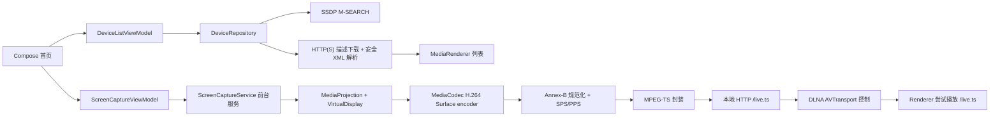
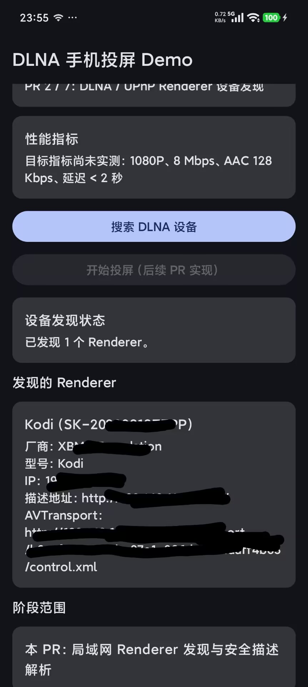
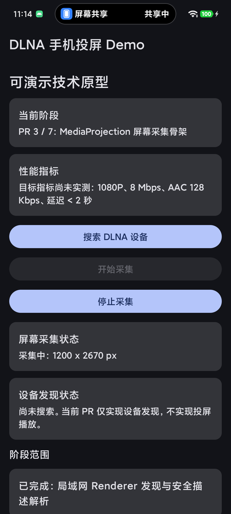
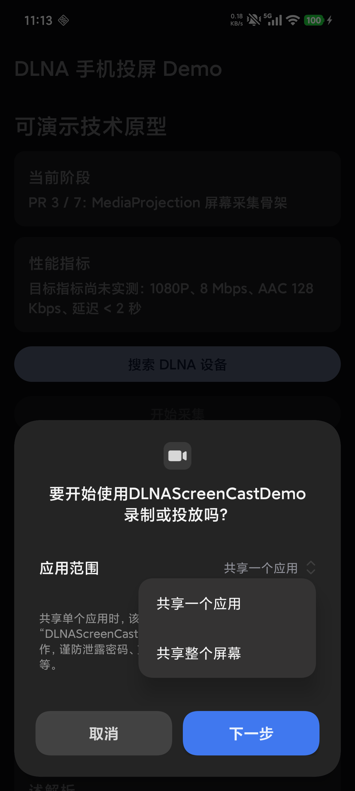
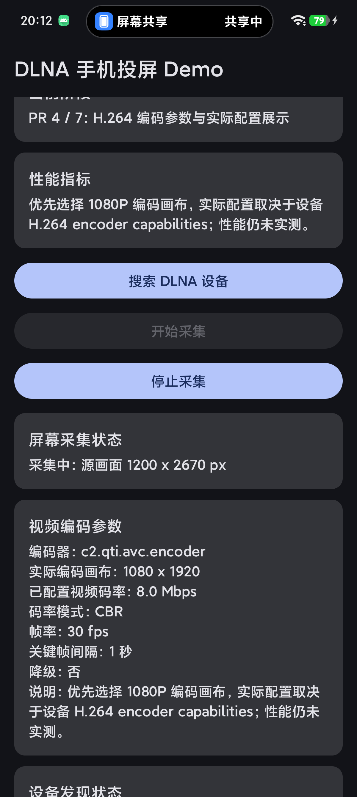
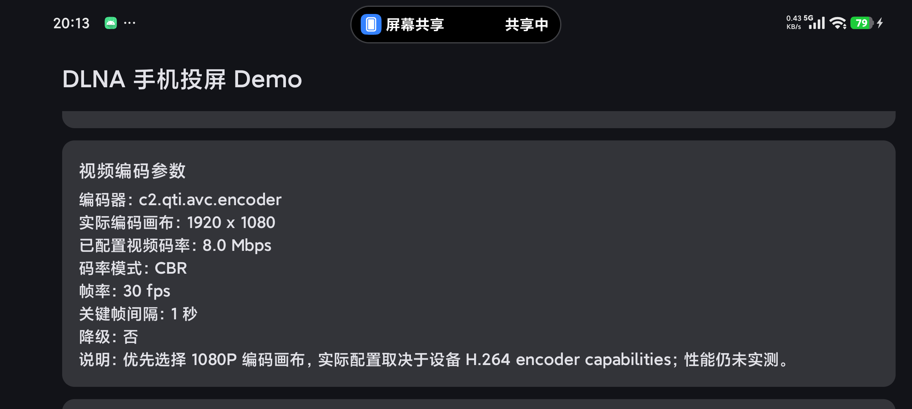
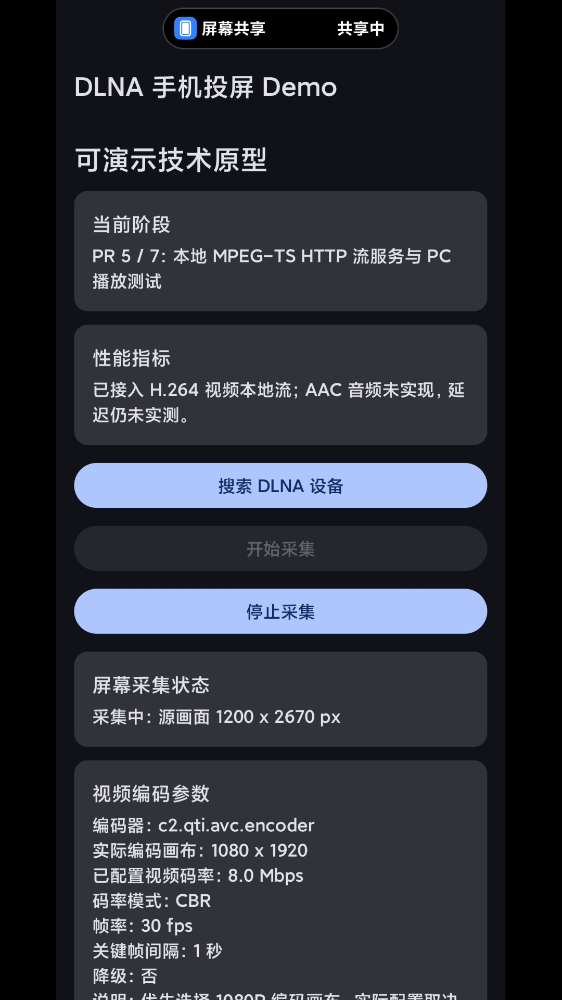

# DLNAScreenCastDemo

Android 手机投屏技术 Demo。项目按 7 个小 PR 逐步完成一个可演示、可测试、可下载 APK 的原型。

当前仓库开发到 **PR 6：DLNA AVTransport 播放控制**。本阶段在 PR 5 已验证的 `/live.ts` 本地 HTTP 流基础上，增加 Renderer 选择、`SetAVTransportURI`、`Play`、`Pause`、`Stop`、分阶段错误展示和 `DlnaControl` 日志。命令发送成功不等于 Renderer 已实际播放画面；真实播放结果必须按手动验收记录。

## 技术目标

| 指标 | 目标值 | 当前结果 |
|---|---:|---|
| 投屏延迟 | `< 2 秒` | 未实测 |
| 视频分辨率 | 优先选择 `1080P` 编码画布 | 实际配置取决于设备 H.264 encoder capabilities；性能未实测 |
| 视频码率 | 优先配置 `8 Mbps` | 动态 10.14 秒样本约 `6.65 Mbps`；不代表长期稳定达标 |
| 音频码率 | `AAC 128 Kbps` | 未实现 |
| 平台 | Android Demo | PR 6 已验证 Kodi 可显示手机画面，但存在周期性缓冲 / 卡顿 |

目标值不代表已达成结果。PR 5 已在当前真机和 PC 热点环境验证 H.264 MPEG-TS 本地流可抓取、可识别并可实时解码；PR 6 增加 AVTransport 控制命令发送和错误映射，并在 Kodi 上完成最小链路演示。当前结论限定为“DLNA AVTransport 控制链路可演示”，不代表最终投屏指标已达成。AAC 音频、延迟 `< 2 秒`、真实电视兼容矩阵和 Kodi 卡顿优化仍未完成。

## 技术架构



## PR 2 已实现

- SSDP `M-SEARCH`，范围固定为 `MediaRenderer:1` 和 `ssdp:all`。
- 按规范化后的 `LOCATION` 去重。
- 解析 `UDN`、`friendlyName`、`manufacturer`、`modelName` 和 AVTransport `controlURL`。
- 设备 ID 优先使用 `UDN`，缺失时回退到描述文档 URL。
- 缺少 AVTransport 的 Renderer 仍展示，并明确标记不可用于后续播控。
- HTTP(S) 描述下载限制超时、响应体大小和最多 1 次重定向。
- XML 禁用 DTD 和外部实体，避免 XXE。
- Android 不支持部分 JAXP 附加防护配置时记录 debug 日志并继续解析，避免阻断正常 Renderer。
- 首页展示搜索状态、设备列表和无电视排查提示。

## PR 3 已实现

- 每次开始采集都重新请求系统录屏授权，不保存或复用旧 token。
- Android 14+ 使用系统默认授权模式，让用户选择共享整个屏幕或只共享一个应用。
- 授权成功后先启动 `mediaProjection` 类型前台服务，再调用 `getMediaProjection()`。
- 注册 `MediaProjection.Callback`，统一处理系统停止、尺寸变化和可见性日志。
- 使用 `WindowManager.maximumWindowMetrics` 和 `Configuration.densityDpi` 获取当前采集尺寸。
- PR 3 使用 `ImageReader(maxImages = 2)` 临时消费并立即关闭最新图像；PR 4 已由 H.264 encoder Surface 接替。
- 首页展示采集状态和当前尺寸，支持 App 内停止和通知停止 action。
- 停止路径按固定顺序幂等释放资源，多次停止不会重复释放。

## PR 4 已实现

- 新增 `EncoderConfig`，集中定义 H.264、目标 `8 Mbps`、`30 fps` 和关键帧间隔 `1 秒`。
- 按横竖屏优先尝试标准编码画布：横屏 `1920 x 1080`，竖屏 `1080 x 1920`；设备不支持时按标准档位降级。
- 选择参数时同时检查 `areSizeAndRateSupported(width, height, 30.0)`、`widthAlignment` 和 `heightAlignment`。
- 优先使用 `BITRATE_MODE_CBR`；设备不支持 CBR 时沿用默认码率模式，并在 UI 展示“默认 / 非 CBR”。
- 使用原生 `MediaCodec` H.264 encoder 和输入 Surface，持续排空编码输出但不保存、不上传。
- 日志记录 codec 名称、请求参数、实际 output format、`csd-0 / csd-1` 是否存在、codec config buffer 数量、first media frame、first key frame 和 encoded frame count，不输出完整二进制内容。
- codec config buffer 不计入首个媒体帧。
- 横竖屏变化时进行 `250ms` 防抖，只处理最后一次目标尺寸；编码画布相同则忽略重建，否则进入 `Reconfiguring` 状态并替换 encoder Surface。
- encoder 停止时依次尝试 `signalEndOfInputStream()`、短时间排空剩余输出、`stop / release codec`、释放输入 Surface 和 `quitSafely()`，单步失败不阻断后续释放。

## PR 5 已实现

- 从 `MediaCodec` output buffer 的有效 `offset / size` 区间读取 H.264 access unit，不把无效字节送入流服务。
- 将 AVC Annex-B / AVCC 输入规范化为 Annex-B；关键帧前补齐最新 SPS / PPS。
- 使用纯 Kotlin MPEG-TS 封装输出 PAT、PMT、H.264 PES、PTS、PCR、continuity counter 和关键帧 random access 标记。
- 使用原生 `ServerSocket` 提供 `http://<phone-wifi-ip>:8080/live.ts`，支持客户端连接和幂等停止释放。
- 只从 `wlan*` 接口选择局域网 IPv4。手机未连接 Wi-Fi 时明确启动失败，不把蜂窝私网地址伪装成 PC 可访问地址。
- 缓存最近关键帧开始的完整 GOP。新客户端连接后先重放该 GOP，再接实时输出，减少中途接入时等待首屏和时间戳跳变。
- 横竖屏重建 encoder 时清空旧 GOP 缓存，等待新画布重新输出 SPS、PPS 和首个关键帧；HTTP URL 保持不变。
- 首页展示当前 `/live.ts` 地址、MPEG-TS + H.264 格式，以及 AAC 音频和延迟尚未完成的边界。
- 停止采集时依次释放 encoder、HTTP 服务、`MediaProjection` 资源；停止后 `/live.ts` 端口关闭。

## PR 6 已实现

- 首页设备卡支持选择 Renderer，并明确展示缺少 AVTransport `controlURL` 的不可控设备。
- 新增 DLNA 播放控制卡，提供独立按钮：
  - “发送到 Renderer / 开始播放”：依次执行 `SetAVTransportURI` + `Play`。
  - “暂停”：只发送 AVTransport `Pause`。
  - “停止播放”：只发送 AVTransport `Stop`。
  - “停止采集”：仍只停止本机 `MediaProjection`、Encoder 和 StreamServer，不负责远端 Stop。
- AVTransport SOAP 使用 `POST` 发送到 `DlnaDevice.avTransportControlUrl`。
- `SOAPAction` 分别对应 `SetAVTransportURI`、`Play`、`Pause`、`Stop`。
- 固定 `InstanceID=0`，`Play` 固定 `Speed=1`。
- `CurrentURIMetaData=""` 作为 PR 6 第一版最小实现。
- XML 参数会转义，不直接拼接未处理 URL。
- 网络请求设置连接和读取超时。
- 协程取消继续抛出，不被普通异常吞掉。
- HTTP 2xx 且无 SOAP Fault 才算当前步骤成功；HTTP 非 2xx 展示状态码。
- SOAP Fault 解析 `faultcode`、`faultstring`，并在存在时展示 UPnPError `errorCode` / `errorDescription`。
- 日志使用 `DlnaControl` tag，记录选择设备、IP、controlURL、streamUrl、阶段、HTTP 状态码、SOAP Fault 摘要和最终结果；普通日志不输出完整 SOAP XML。

## 本阶段不实现

PR 6 不实现以下能力：

- AAC 音频
- 延迟 `< 2 秒` 实测
- HLS
- 多电视兼容矩阵
- Kodi 周期性缓冲 / 卡顿优化
- Release APK
- 乐播云商业 SDK 接入

PR 6 继续使用 PR 5 的 H.264 MPEG-TS `/live.ts` 流服务，不重新实现 MPEG-TS，不修改本地流服务主逻辑。`AAC 128 Kbps`、延迟 `< 2 秒`、不同电视兼容性和卡顿优化仍为目标或后续验证项，当前未完成或未实测。

## 运行环境

- Android Studio：建议使用支持 AGP `9.2.1` 的版本
- Gradle Wrapper：`9.4.1`
- Android Gradle Plugin：`9.2.1`
- Kotlin：AGP 内建 Kotlin `2.2.10`
- `compileSdk`：Android `36.1`
- `minSdk`：Android `26`
- 应用包名：`com.qierong.dlnascreencastdemo`

## 权限说明

Manifest 声明：

```text
INTERNET
ACCESS_NETWORK_STATE
CHANGE_WIFI_MULTICAST_STATE
NEARBY_WIFI_DEVICES
FOREGROUND_SERVICE
FOREGROUND_SERVICE_MEDIA_PROJECTION
POST_NOTIFICATIONS
```

- Android 13+ 搜索前请求 `NEARBY_WIFI_DEVICES`，并使用 `neverForLocation`。
- `ACCESS_NETWORK_STATE` 用于判断当前是否连接 Wi-Fi，并提供明确错误提示。
- SSDP 和设备描述文档依赖局域网访问。许多 Renderer 使用 HTTP 描述地址，因此 App 允许明文 HTTP。
- Android 13+ 首次开始采集时可以请求 `POST_NOTIFICATIONS`。拒绝通知权限可能影响通知栏展示，但不会阻断系统录屏授权流程。
- Android 14+ 使用 `createScreenCaptureIntent()` 的系统默认用户选择模式，不传入 `createConfigForDefaultDisplay()`。系统应允许用户选择共享整个屏幕或只共享一个应用；实际弹窗样式和单应用选择流程可能受厂商 ROM 影响。
- 每次屏幕采集会话都必须重新授权。停止后不得复用旧授权数据或旧 `MediaProjection`。
- Android 16 的本地网络限制为选择启用阶段，不应描述为“Android 16 必须请求附近设备权限”。
- Android 17、`targetSdk 37+` 需要迁移到 `ACCESS_LOCAL_NETWORK`；该迁移点留给后续兼容性 PR。

参考：

- [附近 Wi-Fi 设备权限](https://developer.android.com/develop/connectivity/wifi/wifi-permissions)
- [本地网络权限](https://developer.android.com/privacy-and-security/local-network-permission?hl=zh-cn)

## 如何构建

Windows PowerShell：

```powershell
.\gradlew.bat assembleDebug
.\gradlew.bat testDebugUnitTest
```

Debug APK 输出路径：

```text
app/build/outputs/apk/debug/app-debug.apk
```

## 如何安装 APK

连接 Android 手机并启用 USB 调试后执行：

```powershell
adb install -r app/build/outputs/apk/debug/app-debug.apk
adb shell am start -n com.qierong.dlnascreencastdemo/.MainActivity
adb logcat -s DLNA-Demo ScreenCapture Encoder StreamServer DlnaControl
```

## 无电视测试：Kodi Renderer 发现

准备一台 Android 手机和一台电脑，并连接同一个 Wi-Fi。电脑端安装 Kodi，在以下路径开启 UPnP / DLNA：

```text
Settings -> Services -> UPnP / DLNA
Enable UPnP support
Allow remote control via UPnP
Look for remote UPnP players
```

安装并打开 App 后点击“搜索 DLNA 设备”。通过标准：

- 首页能显示 Kodi 或其他 Renderer。
- 列表显示设备名称、厂商、型号、IP、描述地址和 AVTransport 状态。
- `adb logcat -s DLNA-Demo` 能看到搜索开始、M-SEARCH、响应 URL 和设备数量。

### PR 2 真机验收记录

- 测试时间：2026-06-01
- 手机型号：`23127PN0CC`
- Android 版本：`16`，API `36`
- 网络环境：Windows 电脑热点，手机连接热点；电脑运行 Kodi
- 页面结果：显示 `Kodi (SK-20220818ZFPP)`，IP 为 `192.168.137.1`，并解析出 AVTransport 控制地址
- logcat 结果：`设备搜索结束：发现 1 个 Renderer`
- 结论：PR 2 的局域网 Renderer 发现链路真机验收通过



如果没有搜索到设备，请检查：

1. 手机和电脑或电视是否连接同一 Wi-Fi。
2. Kodi 是否开启 UPnP / DLNA。
3. Windows 防火墙是否拦截局域网访问。
4. 路由器是否开启 AP 隔离。
5. PR 6 播放控制要求设备提供 AVTransport controlURL；只有设备发现不代表一定可播控。

## 无电视测试：PC 抓流与播放

手机和电脑连接同一 Wi-Fi，App 点击“开始采集”并同意系统录屏授权后，首页会显示类似地址：

```text
http://192.168.137.155:8080/live.ts
```

PC 端执行：

```bash
curl -v http://<phone-ip>:8080/live.ts --output sample.ts --max-time 10
ffprobe sample.ts
ffplay -fflags nobuffer -flags low_delay -framedrop -probesize 32 -analyzeduration 0 http://<phone-ip>:8080/live.ts
```

`curl` 对连续流达到 `--max-time` 后返回超时是预期行为。通过标准：

1. HTTP 返回 `200 OK` 和 `Content-Type: video/mp2t`。
2. 抓取文件持续增长。
3. `ffprobe` 能识别 `mpegts` 容器和 `h264` 视频流。
4. `ffplay` 或 FFmpeg 实时解码能够读取画面。
5. 停止采集后端口关闭。

## 无电视测试：DLNA AVTransport 播放控制

PR 6 播放控制的前置条件：

1. PR 5 的 `/live.ts` 本地 HTTP 流已能被 `ffprobe` / `ffplay` 验证。
2. App 首页能展示真实的 `http://<phone-ip>:8080/live.ts`。
3. 手机和电脑 / Kodi 在同一个 Wi-Fi。
4. Kodi 已开启 UPnP / DLNA 和远程控制。

测试前必须关闭正在访问 `/live.ts` 的 `ffplay` / `curl`。当前 StreamServer 按一个活跃客户端的演示路径验证；如果 `ffplay` 仍在连接，Kodi / Renderer 访问 `/live.ts` 可能拿到 `503`，容易误判为 DLNA 播控失败。

手动验收顺序：

1. 手机和电脑 / Kodi 连接同一 Wi-Fi。
2. Kodi 开启 UPnP / DLNA 和远程控制。
3. App 点击“搜索 DLNA 设备”，确认列表显示 Kodi。
4. App 点击“开始采集”，同意系统录屏授权，确认首页显示 `/live.ts`。
5. 确认没有 `ffplay` / `curl` 占用 `/live.ts`。
6. 在设备卡点击“选择 Renderer”。
7. 点击“发送到 Renderer / 开始播放”。
8. 记录 App 状态、`adb logcat -s DlnaControl StreamServer ScreenCapture Encoder`、Kodi 画面表现。

验收结果必须区分三类：

1. `SetAVTransportURI` + `Play` 成功，Kodi 播放出手机画面。
2. SOAP 控制成功，但 Kodi 未能播放当前实时 TS 流。
3. SOAP 控制失败，记录 HTTP 状态码、SOAP Fault 或 UPnPError。

Kodi 通常可以作为最小 Renderer 验证。部分真实电视可能要求 DIDL-Lite metadata 或 DLNA contentFeatures；PR 6 使用空 `CurrentURIMetaData`，不做全电视兼容矩阵。如果设备拒绝空 metadata，必须在已知问题中记录，不得写成投屏成功。

### PR 6 真机验收记录

- 测试时间：2026-06-03
- 手机型号：`23127PN0CC`
- Android 版本：`16`，API `36`
- 网络环境：Windows 电脑热点，手机连接热点；手机 Wi-Fi IP 为 `192.168.137.183`
- 接收端：Windows 端 Kodi，UPnP / DLNA 与远程控制已开启
- Renderer：`Kodi (SK-20220818ZFPP)`，IP 为 `192.168.137.1`
- AVTransport controlURL：`http://192.168.137.1:1932/AVTransport/b3eaf005-844b-07e1-086d-e914aaff4b63/control.xml`
- 本地流地址：`http://192.168.137.183:8080/live.ts`
- 编码参数：源画面 `1200 x 2670`，实际编码画布 `1080 x 1920`，已配置 `8 Mbps`、`30 fps`、关键帧间隔 `1 秒`、`CBR`
- `SetAVTransportURI`：成功
- `Play`：成功
- Kodi 画面表现：能显示手机画面，说明 AVTransport 控制链路与 `/live.ts` 访问链路可以最小演示
- 播放质量：存在周期性缓冲 / 卡顿，表现为加载后短时间流畅，随后再次转圈加载
- 静态样本：`232,368 bytes / 10.13s`，按十进制计算约 `0.18 Mbps`
- 动态样本：`8,425,596 bytes / 10.14s`，按十进制计算约 `6.65 Mbps`；若按 `10s` 粗估约 `6.74 Mbps`
- 动态样本 TS 结构：`44,817` 个 `188` 字节 TS 包，余数 `0`，同步头错误包 `0`
- 样本提交边界：`.ts` 样本、抓包和大体积视频不提交仓库；仓库只保留截图、命令和测试结果摘要
- 结论：PR 6 可写为“DLNA AVTransport 控制链路可演示”。不能写成最终投屏指标已达成。

## PR 3 屏幕采集真机测试

安装并打开 App 后执行：

1. 点击“开始采集”。
2. Android 13+ 如果弹出通知权限，可允许或拒绝；两种选择都应继续进入系统录屏授权。
3. 在系统录屏弹窗中同意本次采集。
4. 确认首页状态变为“采集中”，并显示当前采集尺寸。
5. 旋转手机，确认采集保持运行且尺寸更新。
6. 分别使用 App 内“停止采集”、通知停止 action、系统状态栏停止入口和锁屏测试停止路径。
7. 检查 `adb logcat -s ScreenCapture`，确认出现启动、尺寸变化和资源释放日志。

每次重新开始采集时，App 都会重新调用系统授权 Intent，不保存或复用旧 token。系统是否每次都实际展示弹窗可能受厂商 ROM 行为影响：本次小米真机首次启动和锁屏停止后重新开始时显示弹窗，同一进程内使用 App 按钮停止后再次开始时，系统直接返回新的授权结果。PR 3 使用临时丢弃帧 Surface，不提供可播放流。

### PR 3 真机验收记录

- 测试时间：2026-06-02
- 手机型号：`23127PN0CC`
- Android 版本：`16`，API `36`
- 系统授权：当前 ROM 弹窗提供“共享整个屏幕”和“共享一个应用”选项；App 每次开始都会重新发起系统授权 Intent
- 单应用共享：通过，选择“共享一个应用”后系统进入应用选择器
- 整屏共享：通过，选择“共享整个屏幕”后页面进入 `采集中：1200 x 2670 px`
- 采集尺寸：竖屏 `1200 x 2670`，横屏 `2670 x 1200`
- App 内停止：通过，状态恢复为“未采集”，日志出现“屏幕采集资源释放完成”
- 锁屏停止：通过，日志出现“系统停止屏幕采集”和“屏幕采集资源释放完成”
- 旋转尺寸更新：通过，横竖屏切换各记录一次尺寸更新，不重复创建 `VirtualDisplay`
- 通知权限：当前 ROM 出现通知权限弹窗时采集仍可继续，符合“不阻断系统录屏授权流程”的策略
- 前台通知：已确认通知栏显示“正在采集屏幕画面”；小米通知栏未在自动化 UI tree 中展开自定义停止 action，因此未将通知 action 点击写成已手动通过
- 自动化真机测试：`connectedDebugAndroidTest` 通过，共执行 `3 tests`
- 截图：`docs/screenshots/pr3-screen-capture-source-options.png`、`docs/screenshots/pr3-screen-capture-app-choice.png` 和 `docs/screenshots/pr3-screen-capture-active.png`，仅包含 App 页面、系统授权弹窗和系统录屏状态提示，已检查无聊天、账号或通知隐私
- 结论：PR 3 屏幕采集骨架在当前真机完成授权、采集、旋转、App 停止、锁屏停止和资源释放验收

 

## PR 4 H.264 编码真机测试

安装并打开 App 后执行：

1. 点击“开始采集”，同意系统录屏授权。
2. 确认首页“视频编码参数”卡片显示 codec 名称、实际编码画布、已配置视频码率、码率模式、帧率、关键帧间隔和是否降级。
3. 检查 `adb logcat -s ScreenCapture Encoder`，确认出现 codec 名称、请求参数、实际 output format、`csd-0 / csd-1` 是否存在、codec config buffer、first media frame 和 first key frame。
4. 旋转手机，确认页面短暂进入重配置后展示新方向画布，日志只对最后一次目标尺寸重建 encoder。
5. 使用 App 内按钮停止采集，再次开始采集并锁屏，确认资源释放路径无崩溃。

PR 4 只验证 H.264 编码链路，不提供本地流地址，不使用 `ffplay` 验证播放，不测量延迟。优先选择 `1080P` 编码画布，实际配置取决于设备 H.264 encoder capabilities；性能仍未实测。

### PR 4 真机验收记录

- 测试时间：2026-06-02
- 手机型号：`23127PN0CC`
- Android 版本：`16`，API `36`
- 实际 codec：`c2.qti.avc.encoder`
- 竖屏参数：源画面 `1200 x 2670`，实际编码画布 `1080 x 1920`，已配置 `8 Mbps`、`30 fps`、关键帧间隔 `1 秒`、`CBR`
- 横屏参数：源画面 `2670 x 1200`，实际编码画布 `1920 x 1080`，已配置 `8 Mbps`、`30 fps`、关键帧间隔 `1 秒`、`CBR`
- 编码输出：实际 output format 记录 `csd-0=true`、`csd-1=true`；codec config buffer、first media frame 和 first key frame 分别记录
- 旋转重建：通过；横竖屏变化时 encoder 自动重建，重复 resize 在编码画布未变化时忽略
- App 内停止：通过；页面恢复“未采集”，encoder 释放时记录最终帧计数，随后记录“屏幕采集资源释放完成”
- 锁屏停止：通过；日志出现“系统停止屏幕采集”、encoder 释放统计和“屏幕采集资源释放完成”
- 自动化真机测试：`connectedDebugAndroidTest` 通过，共执行 `3 tests`
- 安装说明：第一次 `adb install -r` 被小米系统拦截并返回 `INSTALL_FAILED_USER_RESTRICTED: Install canceled by user`；再次执行后安装成功
- 截图：`docs/screenshots/pr4-h264-portrait.png` 和 `docs/screenshots/pr4-h264-landscape.png`，仅包含 Demo 页面与系统屏幕共享状态，已检查无聊天、账号或通知隐私
- 结论：PR 4 已在当前真机验证 H.264 编码启动、输出排空、参数展示、旋转重建、App 停止、锁屏停止和资源释放。该结论不代表推流可播放或性能指标达标。

 

## PR 5 本地流真机与 PC 验收记录

- 测试时间：2026-06-02
- 手机型号：`23127PN0CC`
- Android 版本：`16`，API `36`
- 网络环境：Windows 电脑热点，手机连接热点；手机 Wi-Fi IP 为 `192.168.137.155`
- 本地流地址：`http://192.168.137.155:8080/live.ts`
- HTTP 抓流：PC 执行 `curl --max-time 10`，收到 `HTTP/1.1 200 OK`、`Content-Type: video/mp2t`
- TS 样本：10 秒抓取 `159988` 字节，共 `851` 个 `188` 字节 TS 包，余数 `0`，同步头错误包 `0`
- `ffprobe`：识别 `mpegts` 容器、`h264` 视频流和竖屏 `1080 x 1920`
- PC 样本解码：FFmpeg 成功从 TS 样本解码出手机 Demo 页面画面
- PC 实时解码：FFmpeg 对 `/live.ts` 进行 `5` 秒实时解码，竖屏和横屏均返回 `exit=0`
- 横竖屏重建：通过；横屏重建后同一 URL 继续解码，编码画布为 `1920 x 1080`，恢复竖屏后重新回到 `1080 x 1920`
- Wi-Fi 边界：验收中曾发现手机未连热点时只剩蜂窝私网地址；已改为仅接受 `wlan*` 接口 IPv4，避免展示 PC 不可访问 URL
- App 内停止：通过；日志依次出现 encoder 释放、`本地流服务已停止` 和屏幕采集资源释放
- 停止后端口：PC 再次请求 `/live.ts` 返回连接拒绝
- 自动化真机测试：`connectedDebugAndroidTest` 通过，共执行 `3 tests`
- 边界：AAC 音频、DLNA AVTransport 播放控制、延迟 `< 2 秒` 均未实现或未实测

PC 从真实 TS 样本解码出的画面：



## 技术指标测试方法

延迟必须通过可复现方式测量：手机画面显示时间戳，电脑使用 `ffplay` 播放手机流，再使用另一台设备同时拍摄手机和电脑屏幕，根据时间差或视频帧差计算延迟。至少记录 3 次结果和平均值。

PR 5 已提供可由 PC 抓取和解码的 H.264 MPEG-TS 本地流。PR 6 已接入 DLNA AVTransport 控制命令，并已验证 Kodi 可以显示手机画面；但播放存在周期性缓冲 / 卡顿。该结果只证明 AVTransport 控制链路可演示，不证明延迟 `< 2 秒`、长期稳定 `8 Mbps`、AAC `128 Kbps` 或真实电视兼容性已经达成。

## PR 开发顺序

| PR | 内容 | 状态 |
|---|---|---|
| PR 1 | Kotlin + Jetpack Compose 初始化、README、基础页面、最小测试 | 已合并 |
| PR 2 | DLNA / UPnP Renderer 发现 | 已合并 |
| PR 3 | MediaProjection 权限与采集状态 | 已合并 |
| PR 4 | H.264 编码参数与展示 | 已合并 |
| PR 5 | 本地 HTTP 流服务与 PC 播放测试 | 已合并 |
| PR 6 | DLNA AVTransport 控制 | 当前 PR |
| PR 7 | 测试报告、截图、README 收尾、Release APK | 未开始 |

## 已知问题

- 部分路由器、防火墙或 Renderer 实现可能影响 SSDP 发现。
- Android 14+ 的整屏 / 单应用选择弹窗样式和单应用选择流程可能受厂商 ROM 影响。
- MPEG-TS 当前只包含 H.264 视频，不包含 AAC 音频。
- PR 6 使用空 `CurrentURIMetaData`；部分真实电视可能要求 DIDL-Lite metadata 或 DLNA contentFeatures。
- SOAP 控制成功不代表 Renderer 已播放出画面；PR 6 已验证 Kodi 可显示手机画面，但不能外推到真实电视兼容矩阵。
- Kodi 播放 `/live.ts` 存在周期性缓冲 / 卡顿，本 PR 不继续优化。
- DLNA 播放测试前必须关闭 `ffplay` / `curl`，避免 `/live.ts` 被占用导致 Renderer 请求失败。
- H.264 编码配置不等于性能实测，延迟 `< 2 秒` 尚未按可复现方法测量。
- 尚未发布 GitHub Release APK。
- 系统音频采集受 Android 权限和应用捕获策略限制，后续实现时必须按真实结果记录。

## 开源参考声明

PR 2 参考 UPnP Device Architecture；PR 3 参考 Android 官方 MediaProjection 和前台服务文档；PR 4 参考 Android 官方 `MediaCodec`、`MediaFormat` 和 `VideoCapabilities` 文档；PR 5 参考 MPEG-TS、PES、PAT / PMT 基础结构和 FFmpeg 验证方式；PR 6 参考 UPnP AVTransport SOAP 控制概念。没有复制第三方项目代码。乐播云仅作为商业兼容方案参考，没有接入其 SDK。

## 截图与录屏

PR 2 已保存 Kodi Renderer 真机发现截图。PR 3 已保存脱敏屏幕采集截图。PR 4 已保存一张竖屏和一张横屏编码参数脱敏截图，并按同一场景紧凑并排展示。PR 5 已保存 PC 从真实 TS 样本解码出的手机 Demo 页面画面。PR 6 不提交 `.ts` 样本、抓包或大体积视频，只记录命令和测试结果摘要。当前小米 ROM 在采集期间执行 `adb screencap` 会触发系统停止采集，因此未保留无效黑屏截图。

## Release 下载

仓库地址：[QieRong/DLNAScreenCastDemo](https://github.com/QieRong/DLNAScreenCastDemo)

Release APK 尚未发布。
