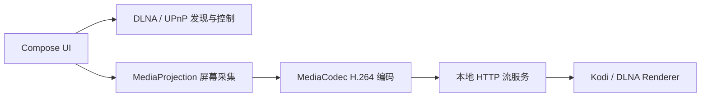

# DLNAScreenCastDemo

Android 手机投屏技术 Demo。项目计划在约 3 天内按 7 个小 PR 逐步完成一个可演示、可测试、可下载 APK 的原型。

当前仓库仅完成 **PR 1：Jetpack Compose 项目初始化**。DLNA 发现、屏幕采集、视频编码、本地流服务和播放控制尚未实现。

## 技术目标

| 指标 | 目标值 | 当前结果 |
|---|---:|---|
| 投屏延迟 | `< 2 秒` | 未实测 |
| 视频分辨率 | `1080P` | 未实测 |
| 视频码率 | `8 Mbps` | 未实测 |
| 音频码率 | `AAC 128 Kbps` | 未实测 |
| 平台 | Android Demo | PR 1 已建立基础工程 |

没有真实测试数据前，本项目不会把目标值写成已达成结果。

## 技术架构



PR 1 只包含图中的 Compose UI 骨架。其他节点会按后续 PR 顺序实现。

## 当前页面

Compose 首页目前展示：

- 当前阶段：`PR 1 / 7`
- 后续功能列表
- 性能指标“未实测”提示
- 禁用状态的“搜索设备”和“开始投屏”按钮

禁用按钮是后续 PR 的入口占位，不代表功能已经实现。

## 运行环境

- Android Studio：建议使用支持 AGP `9.2.1` 的版本
- Gradle Wrapper：`9.4.1`
- Android Gradle Plugin：`9.2.1`
- Kotlin：AGP 内建 Kotlin `2.2.10`
- Compose Compiler Gradle Plugin：`2.2.10`
- `compileSdk`：Android `36.1`
- `minSdk`：Android `26`
- 应用包名：`com.example.dlnascreencastdemo`

## 如何构建

Windows PowerShell：

```powershell
.\gradlew.bat assembleDebug
.\gradlew.bat testDebugUnitTest
```

macOS / Linux / Git Bash：

```bash
./gradlew assembleDebug
./gradlew testDebugUnitTest
```

Debug APK 输出路径：

```text
app/build/outputs/apk/debug/app-debug.apk
```

## 如何安装 APK

连接 Android 手机并启用 USB 调试后执行：

```bash
adb install -r app/build/outputs/apk/debug/app-debug.apk
adb shell am start -n com.example.dlnascreencastdemo/.MainActivity
```

## 无电视测试

PR 1 可以验证 App 构建、安装和首页启动。完整无电视投屏验证会在本地流服务完成后补齐：

1. 准备一台 Android 手机和一台电脑，并连接同一个 Wi-Fi。
2. 在电脑端安装 Kodi，后续用作 UPnP / DLNA Renderer。
3. 本地流服务完成后，用 `curl` 抓取流并用 `ffprobe` 检查格式。
4. 用 `ffplay` 播放手机提供的流地址并记录实际延迟。

计划使用的播放命令：

```bash
ffplay -fflags nobuffer -flags low_delay -framedrop -probesize 32 -analyzeduration 0 http://<phone-ip>:8080/live.ts
```

当前 PR 尚未提供流地址，因此上述命令现在不能用于验收。

## Kodi 测试准备

后续 DLNA 发现 PR 中，电脑端 Kodi 需要开启：

```text
Settings -> Services -> UPnP / DLNA
Enable UPnP support
Allow remote control via UPnP
Look for remote UPnP players
```

## 技术指标测试方法

延迟必须通过可复现方式测量：

1. 手机画面显示时间戳。
2. 电脑使用 `ffplay` 播放手机流。
3. 使用另一台设备同时拍摄手机和电脑屏幕。
4. 根据时间差或视频帧差计算延迟。
5. 至少记录 3 次结果和平均值。

PR 1 没有投屏链路，所有技术指标均为“未实测”。

## PR 开发顺序

| PR | 内容 | 状态 |
|---|---|---|
| PR 1 | Kotlin + Jetpack Compose 初始化、README、基础页面、最小测试 | 当前 PR |
| PR 2 | DLNA / UPnP Renderer 发现 | 未开始 |
| PR 3 | MediaProjection 权限与采集状态 | 未开始 |
| PR 4 | H.264 编码参数与展示 | 未开始 |
| PR 5 | 本地 HTTP 流服务与 PC 播放测试 | 未开始 |
| PR 6 | DLNA AVTransport 控制 | 未开始 |
| PR 7 | 测试报告、截图、README 收尾、Release APK | 未开始 |

## 已知问题

- PR 1 只有 Compose 页面骨架，尚不能搜索设备或投屏。
- 尚未在真机安装和启动 APK。
- 尚未生成截图或录屏。
- 尚未发布 GitHub Release APK。
- 系统音频采集受 Android 权限和应用捕获策略限制，后续实现时必须按真实结果记录。

## 开源参考声明

PR 1 仅参考 Android 官方 Jetpack Compose 配置方式，没有复制第三方项目代码。

## 截图与录屏

未完成。将在真机冒烟测试和最终演示阶段补充。

## Release 下载

仓库地址：[QieRong/DLNAScreenCastDemo](https://github.com/QieRong/DLNAScreenCastDemo)

Release APK 尚未发布。阶段版本计划从 `v0.1.0-bootstrap` 开始。
