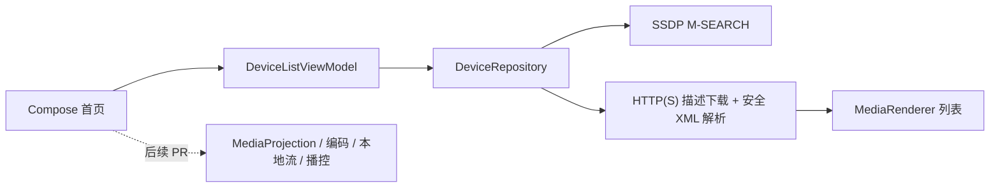

# DLNAScreenCastDemo

Android 手机投屏技术 Demo。项目按 7 个小 PR 逐步完成一个可演示、可测试、可下载 APK 的原型。

当前仓库完成到 **PR 2：DLNA / UPnP SSDP Renderer 设备发现**。本阶段只负责在同一局域网内搜索 Renderer、安全解析设备描述文档并在首页展示结果。

## 技术目标

| 指标 | 目标值 | 当前结果 |
|---|---:|---|
| 投屏延迟 | `< 2 秒` | 未实测 |
| 视频分辨率 | `1080P` | 未实测 |
| 视频码率 | `8 Mbps` | 未实测 |
| 音频码率 | `AAC 128 Kbps` | 未实测 |
| 平台 | Android Demo | PR 2 已实现设备发现代码 |

目标值不代表已达成结果。当前没有真机和 Kodi 局域网实测证据，因此：**局域网 Renderer 发现未实测**。

## 技术架构



## PR 2 已实现

- SSDP `M-SEARCH`，范围固定为 `MediaRenderer:1` 和 `ssdp:all`。
- 按规范化后的 `LOCATION` 去重。
- 解析 `UDN`、`friendlyName`、`manufacturer`、`modelName` 和 AVTransport `controlURL`。
- 设备 ID 优先使用 `UDN`，缺失时回退到描述文档 URL。
- 缺少 AVTransport 的 Renderer 仍展示，并明确标记不可用于后续播控。
- HTTP(S) 描述下载限制超时、响应体大小和最多 1 次重定向。
- XML 禁用 DTD 和外部实体，避免 XXE。
- 首页展示搜索状态、设备列表和无电视排查提示。

## 本阶段不实现

PR 2 不实现以下能力：

- `MediaProjection` 屏幕采集
- H.264 编码
- 本地流服务
- DLNA 播放控制

首页中的“开始投屏”按钮保持禁用。`1080P`、`8 Mbps`、`AAC 128 Kbps`、延迟 `< 2 秒` 均为目标指标，当前未实测。

## 运行环境

- Android Studio：建议使用支持 AGP `9.2.1` 的版本
- Gradle Wrapper：`9.4.1`
- Android Gradle Plugin：`9.2.1`
- Kotlin：AGP 内建 Kotlin `2.2.10`
- `compileSdk`：Android `36.1`
- `minSdk`：Android `26`
- 应用包名：`com.qierong.dlnascreencastdemo`

## 权限说明

Manifest 声明：

```text
INTERNET
ACCESS_NETWORK_STATE
CHANGE_WIFI_MULTICAST_STATE
NEARBY_WIFI_DEVICES
```

- Android 13+ 搜索前请求 `NEARBY_WIFI_DEVICES`，并使用 `neverForLocation`。
- `ACCESS_NETWORK_STATE` 用于判断当前是否连接 Wi-Fi，并提供明确错误提示。
- SSDP 和设备描述文档依赖局域网访问。许多 Renderer 使用 HTTP 描述地址，因此 App 允许明文 HTTP。
- Android 16 的本地网络限制为选择启用阶段，不应描述为“Android 16 必须请求附近设备权限”。
- Android 17、`targetSdk 37+` 需要迁移到 `ACCESS_LOCAL_NETWORK`；该迁移点留给后续兼容性 PR。

参考：

- [附近 Wi-Fi 设备权限](https://developer.android.com/develop/connectivity/wifi/wifi-permissions)
- [本地网络权限](https://developer.android.com/privacy-and-security/local-network-permission?hl=zh-cn)

## 如何构建

Windows PowerShell：

```powershell
.\gradlew.bat assembleDebug
.\gradlew.bat testDebugUnitTest
```

Debug APK 输出路径：

```text
app/build/outputs/apk/debug/app-debug.apk
```

## 如何安装 APK

连接 Android 手机并启用 USB 调试后执行：

```powershell
adb install -r app/build/outputs/apk/debug/app-debug.apk
adb shell am start -n com.qierong.dlnascreencastdemo/.MainActivity
adb logcat -s DLNA-Demo
```

## 无电视测试：Kodi Renderer 发现

准备一台 Android 手机和一台电脑，并连接同一个 Wi-Fi。电脑端安装 Kodi，在以下路径开启 UPnP / DLNA：

```text
Settings -> Services -> UPnP / DLNA
Enable UPnP support
Allow remote control via UPnP
Look for remote UPnP players
```

安装并打开 App 后点击“搜索 DLNA 设备”。通过标准：

- 首页能显示 Kodi 或其他 Renderer。
- 列表显示设备名称、厂商、型号、IP、描述地址和 AVTransport 状态。
- `adb logcat -s DLNA-Demo` 能看到搜索开始、M-SEARCH、响应 URL 和设备数量。

如果没有搜索到设备，请检查：

1. 手机和电脑或电视是否连接同一 Wi-Fi。
2. Kodi 是否开启 UPnP / DLNA。
3. Windows 防火墙是否拦截局域网访问。
4. 路由器是否开启 AP 隔离。
5. 当前 PR 仅实现设备发现，不实现投屏播放。

## 后续无电视投屏测试

本地流服务完成后，计划使用以下命令验证流地址：

```bash
curl -v http://<phone-ip>:8080/live.ts --output sample.ts --max-time 10
ffprobe sample.ts
ffplay -fflags nobuffer -flags low_delay -framedrop -probesize 32 -analyzeduration 0 http://<phone-ip>:8080/live.ts
```

当前 PR 尚未提供流地址，上述命令不能用于本阶段验收。

## 技术指标测试方法

延迟必须通过可复现方式测量：手机画面显示时间戳，电脑使用 `ffplay` 播放手机流，再使用另一台设备同时拍摄手机和电脑屏幕，根据时间差或视频帧差计算延迟。至少记录 3 次结果和平均值。

PR 2 没有投屏链路，所有技术指标均为“未实测”。

## PR 开发顺序

| PR | 内容 | 状态 |
|---|---|---|
| PR 1 | Kotlin + Jetpack Compose 初始化、README、基础页面、最小测试 | 已合并 |
| PR 2 | DLNA / UPnP Renderer 发现 | 当前 PR |
| PR 3 | MediaProjection 权限与采集状态 | 未开始 |
| PR 4 | H.264 编码参数与展示 | 未开始 |
| PR 5 | 本地 HTTP 流服务与 PC 播放测试 | 未开始 |
| PR 6 | DLNA AVTransport 控制 | 未开始 |
| PR 7 | 测试报告、截图、README 收尾、Release APK | 未开始 |

## 已知问题

- 局域网 Renderer 发现未实测。
- 尚未连接真机或 Kodi 完成手动验收。
- 部分路由器、防火墙或 Renderer 实现可能影响 SSDP 发现。
- 尚未生成截图或录屏。
- 尚未发布 GitHub Release APK。
- 系统音频采集受 Android 权限和应用捕获策略限制，后续实现时必须按真实结果记录。

## 开源参考声明

PR 2 参考 UPnP Device Architecture 和 Android 官方权限文档中的协议与平台约束，没有复制第三方项目代码。乐播云仅作为兼容性参考，没有接入其 SDK。

## 截图与录屏

未完成。将在真机冒烟测试和最终演示阶段补充。

## Release 下载

仓库地址：[QieRong/DLNAScreenCastDemo](https://github.com/QieRong/DLNAScreenCastDemo)

Release APK 尚未发布。
